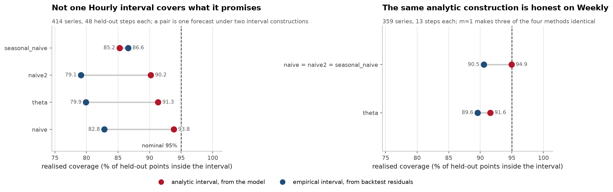
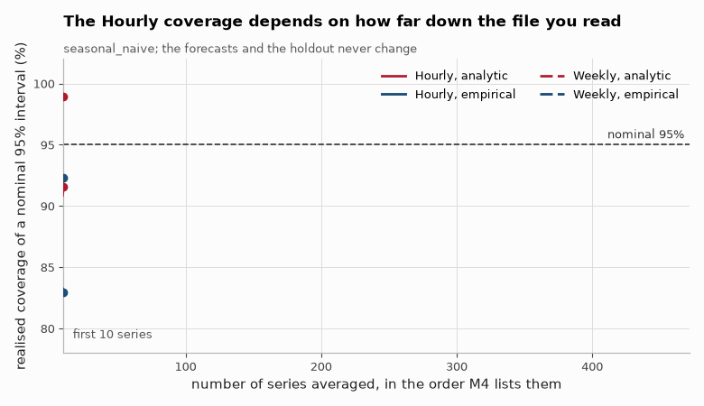
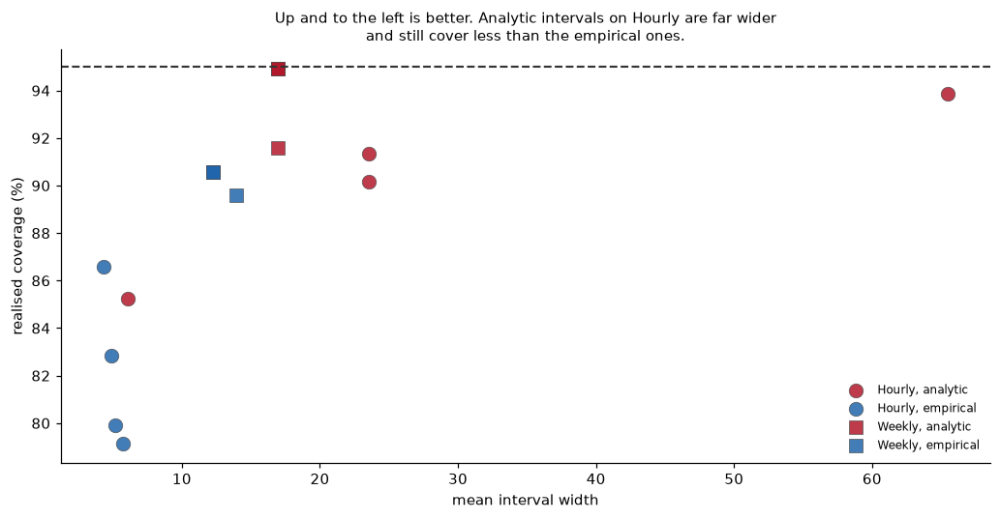
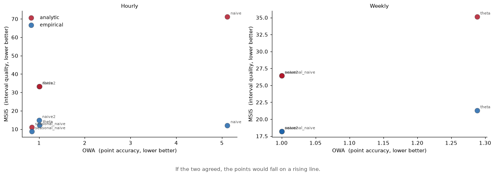
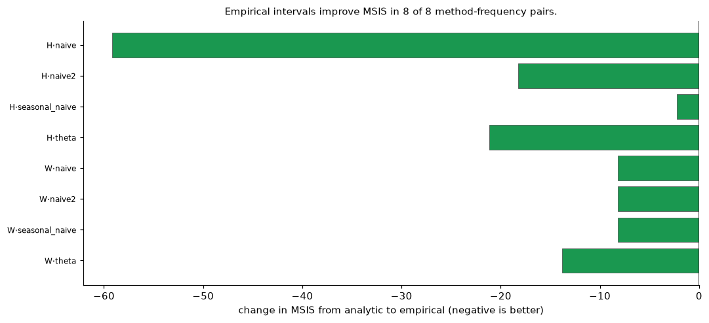
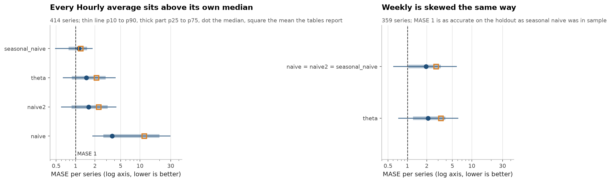

# Forecasting, the interval is the forecast, and mine were wrong

[](https://github.com/aghasalim/m4-forecasting/actions/workflows/ci.yml)
[](https://www.python.org/)
[](LICENSE)

Forecasting on the [M4 competition](https://github.com/Mcompetitions/M4-methods)
benchmark, 414 Hourly and 359 Weekly series, scored on M4's own holdout so the
numbers are comparable to published work rather than to a split I invented.
Built by a third-year Applied Computer Science (AI) student.

Nobody staffs a warehouse against the mean. They staff against the upper bound.
So this project treats the **prediction interval** as the deliverable and point
accuracy as the easy part, because a nominal 95% interval that covers 85% of
the time is not slightly imperfect, it is wrong, and no sMAPE will ever say so.

---


---

## Abstract

M4 is scored on point accuracy, and the prediction interval is usually an
afterthought. This work reverses that emphasis: the same four baseline methods are
run on the Hourly and Weekly subsets under two interval constructions, and the
question is whether a nominal 95% interval contains the truth 95% of the time.

Mostly it does not. Weekly analytic intervals land on 94.9% for three of the
four methods, essentially nominal. Everything on Hourly under-covers, worst case
79.1% against a nominal 95%, a 16-point shortfall on an interval a user would
take at face value. Empirical intervals under-cover on Weekly too, but buy their
coverage far more cheaply. Only `seasonal_naive` is both wider and worse on
Hourly: its analytic interval is 41% wider than its empirical one and still
covers less, 85.2% against 86.6%. For the other three methods the analytic
interval does cover more, but it is 4 to 13 times wider, and its MSIS is worse
in every case.

Point accuracy and interval quality also do not rank the methods the same way.
OWA and MSIS disagree, so a method chosen on the competition metric carries no
guarantee about the intervals it produces.

**Contributions.** (i) Coverage measured against nominal rather than assumed.
(ii) A width-versus-coverage comparison separating honest coverage from wide
intervals. (iii) Evidence that the point-forecast ranking and the interval ranking
differ. (iv) Per-series distributions behind every aggregate, so the spread is
visible before a two-decimal ranking is read as settled.

---

## 1. Three results

**1. Nothing achieves its nominal coverage on Hourly. The best is 93.9%, and
it is the widest interval on the board.**

Every method here advertises a 95% interval. None delivers one:

| method | interval | coverage (nominal 95%) | width | MSIS |
|---|---|---|---|---|
| naive | analytic | 93.9% | 65.48 | 71.24 |
| theta | analytic | 91.3% | 23.52 | 33.30 |
| naive2 | analytic | 90.2% | 23.52 | 33.19 |
| **seasonal_naive** | **empirical** | **86.6%** | **4.31** | **8.82** |
| seasonal_naive | analytic | 85.2% | 6.06 | 11.06 |
| naive | empirical | 82.8% | 4.87 | 12.10 |
| theta | empirical | 79.9% | 5.14 | 12.18 |
| naive2 | empirical | 79.1% | 5.73 | 14.95 |

The top of that table is sorted by width as much as by coverage. `naive` gets
closest to nominal, 93.9%, on a width of **65.48**, fifteen times the narrowest
interval here. That is the trap in reading coverage alone: any target is
reachable by widening until the interval is useless. MSIS charges for width, and
the three widest rows are the three worst on it, naive analytic worst of all at
71.24. The bold row is the best MSIS, not the best coverage.

**2. Measuring your errors beats trusting your model.** Same point forecast,
two ways of putting an interval around it. For `seasonal_naive`, empirical
residual quantiles give **better coverage (86.6% vs 85.2%) at 29% narrower
width**, and MSIS drops from 11.06 to 8.82. The model's analytic band assumes
Gaussian, correctly-specified residuals; both are false, in the same direction.

**3. The baseline nobody reports wins outright.** On Hourly, `seasonal_naive`
takes an **OWA of 0.843**: best point accuracy *and* best intervals. Theta, the
method that won M3, scores **1.013**: worse than the naive2 baseline it is
measured against. On Weekly it is worse still, at 1.288.

| Hourly | sMAPE | MASE | OWA |
|---|---|---|---|
| **seasonal_naive** | **13.91** | **1.19** | **0.843** |
| theta | 15.41 | 2.11 | 1.013 |
| naive2 (baseline) | 17.36 | 2.27 | 1.000 |
| naive | 43.00 | 11.61 | 5.118 |

---





*Coverage as more series are averaged in, on the same seasonal_naive
forecasts and the same M4 holdout. Each line ends on the coverage quoted in the
first table, well short of the nominal 95%.*









Every number in the tables above is a mean over hundreds of series, and the last
figure is the spread behind them. The distributions overlap heavily, which is
worth seeing before reading a two-decimal ranking as settled.

## 2. The bug, which is the point of the tests

My first empirical intervals covered **44 to 49%** on a nominal 95%. The cause was
not subtle once seen: I estimated the 2.5% and 97.5% quantiles from **three**
backtest folds. A tail quantile of three numbers cannot reach past their minimum
and maximum, so the "95% interval" was really about a 50% one.

What makes it worth writing down is that it *passed every test I had*, because
every test I had asked whether the maths ran, not whether an interval covered
anything. The fix is a fold count derived from available history (up to 24) with
a floor of 12 before tail quantiles are trusted at all, below that it falls
back to a Gaussian scaling of the same residuals, which uses them without
pretending to resolve their tails. `tests/test_fc.py` now asserts end-to-end
coverage, which is the test that would have caught it.

---

## 3. Everything here is computed twice

Every number on this page comes out of one pandas run in
[`src/fc/backtest.py`](src/fc/backtest.py). So does every figure. If the
aggregation in `summarise` were wrong, nothing downstream would catch it,
because everything downstream reads the same output: the figures would agree
with the tables because they are the same numbers. Section 2 is about a bug that
passed every test I had, and those tests still only ask whether the code runs.

So the published tables are rebuilt from the per series files,
[`reports/raw_Hourly.csv`](reports/raw_Hourly.csv) and
[`reports/raw_Weekly.csv`](reports/raw_Weekly.csv), by eight implementations in
eight other languages, the per series numbers are rebuilt from the M4 data
itself, and CI fails if any two disagree. A mistake would have to be made
identically in all of them to survive.

| implementation | what it recomputes | measured agreement |
| --- | --- | --- |
| [`verify/summary.sql`](verify/summary.sql) | all 16 published summary rows, from the 6184 per series rows, in SQLite | worst cell 4.8e-05, which is the four decimal rounding in the published files |
| [`verify/metrics.c`](verify/metrics.c) | every OWA from the sMAPE and MASE of the same series, and the seasonal naive forecast and MASE denominator from the M4 CSVs | OWA exact, 0.0e+00 on 6184 rows; sMAPE within 4.3e-14 and MASE within 1.8e-14 on 414 series |
| [`verify/gocheck`](verify/gocheck) | the structure of all four results files, and all 39 figures printed in the README | no ragged rows, duplicate columns, empty cells, NaN, Inf or out of range values; every figure within half a unit of its last printed digit |
| [`verify/verify.R`](verify/verify.R) | the coverage and MSIS claims, by resampling the series, 4000 draws | all 8 Hourly intervals stop below 0.95, the tightest upper end at 0.9461; the three Weekly analytic rows contain it; sign test on MSIS worst p 1.0e-16 |
| [`verify/stability`](verify/stability) | the ranking under all 773 leave one out deletions, and how much of the R bootstrap is noise, 100,000 draws | the winner never changes; the tightest coverage margin is 24.7 times the scatter of its own interval endpoint |
| [`verify/summary.js`](verify/summary.js) | `reports/summary.json` against the two summary CSVs, and `n` from the raw files | all 112 cells identical, 0.0e+00 |
| [`verify/invariants.rb`](verify/invariants.rb) | the structural promises of the backtest, on all 6184 rows | point metrics identical under both interval constructions on all 773 series; naive2 OWA exactly 1; every coverage a whole number of hits out of 48 and 13 |
| [`verify/Claims.java`](verify/Claims.java) | the 23 derived claims in the prose, which no table contains | all 23 still follow from `reports/`, including the two Weekly numbers no table carries |

Run them all with [`./verify/verify.sh`](verify/verify.sh), which prints
`8 passed, 0 failed, 0 skipped` on a machine with all eight toolchains and skips
the ones it cannot find. The C kernel that reads the competition data needs
`make data` first, since the 6 MB of M4 CSVs are not in the repository; without
them it says so and the rest of that check still runs.

**Two claims stopped being point estimates.** Section 1 says nothing reaches its
nominal coverage on Hourly and that the Weekly analytic interval is essentially
nominal. Both were means over a few hundred series with no error bar. Resampling
the series in base R puts every Hourly interval's upper end below 0.95, closest
for `naive` analytic at 0.9461, and the three Weekly analytic rows at 0.9494 do
contain 0.95, so the contrast the README draws between the two frequencies is a
real one and not a rounding.

**The Rust asks whether that bootstrap was big enough.** A 4000 draw interval
endpoint is itself an estimate with its own scatter, and the `naive` analytic
margin above is only 0.0039 wide. Thirty independent 4000 draw runs put the
scatter of that endpoint at sd 0.00016 to 0.00048, so the smallest margin is
24.7 standard deviations. It also deletes every one of the 773 series in turn
and recomputes all eight group means each time: `seasonal_naive` is the best OWA
on Hourly in all 414 deletions, its empirical interval is the best MSIS in all
414, and theta stays above the Naive2 baseline it is measured against, in
[1.0080, 1.0144] on Hourly and [1.2760, 1.2910] on Weekly.

**The harness is itself checked.** CI moves one published MSIS by 0.1, requires
the harness to reject it, restores it and requires a pass, because a check that
cannot fail is not evidence. I ran eleven corruptions locally and each
implementation catches what it is responsible for and nothing more:

| corruption | rejected by |
| --- | --- |
| one MSIS cell in `summary_Hourly.csv`, 11.057 to 11.157 | SQL, Go, JavaScript, Java |
| one series' OWA in `raw_Hourly.csv` | SQL, C, Ruby |
| one coverage set to 1.5 | SQL, Go, R |
| one data row deleted from `raw_Weekly.csv` | SQL, Go, R, Rust, JavaScript, Ruby |
| a width changed in the README table | Go |
| `41% wider` changed to `51% wider` in the prose | Java |
| one value in `summary.json`, CSVs untouched | JavaScript |
| one in sample observation in `data/Hourly-train.csv` | C |
| one holdout observation in `data/Hourly-test.csv` | C |
| `seasonal_naive` empirical MSIS tripled | SQL, R, Rust |
| `naive` analytic coverage set to 47/48 | SQL, R, Rust |

## 4. Limitations

- **Weekly has no seasonality in M4's setup** (`m=1`), so `naive`, `naive2` and
`seasonal_naive` are the *same forecast* there and report identical numbers.
  That is correct behaviour, not a bug, and it is why the Weekly table looks
  degenerate.
- **I have not compared these against the published M4 leaderboard.** OWA here
  is computed against my own Naive2 implementation, which is the competition's
  definition but not necessarily identical to their code to the decimal. Ranking
  claims are internal to this repo.
- **Two frequencies, not six.** Hourly and Weekly are 773 of M4's 100,000
  series. Hourly is strongly seasonal and Weekly is not, which is a deliberate
  contrast, but Monthly and Quarterly dominate the real benchmark and are absent.
- **No ML models.** Only statistical baselines. The M4 finding that pure ML
  underperformed statistical methods is well known; testing it myself is the
  obvious next step and is not done here.

Notably, the Weekly analytic interval for `seasonal_naive` *is* well calibrated
(94.9% against 95%) while its Hourly one is not (85.2%). The same construction
on the same method, honest on one frequency and not the other, which is the
argument for measuring coverage per dataset rather than trusting a method's
reputation.

## 5. Running it

```bash
make setup && make test
```

```bash
make data && make backtest
```

Data is fetched from the public
[M4-methods](https://github.com/Mcompetitions/M4-methods) repository. No
credentials, no API keys.

## 6. Licence

MIT. M4 data © the M4 competition organisers.

## References

The papers and sources this implementation follows. Each one is here because
the code uses the method, the dataset or the metric it describes.

- **Makridakis, Spiliotis, Assimakopoulos. The M4 Competition: 100,000 time series and 61 forecasting methods. International Journal of Forecasting 36, 2020.** the dataset, the Naive2 benchmark and the OWA metric.
- **Hyndman, Koehler. Another look at measures of forecast accuracy. International Journal of Forecasting 22, 2006.** MASE.
- **Assimakopoulos, Nikolopoulos. The theta model. International Journal of Forecasting 16, 2000.** the Theta method.
